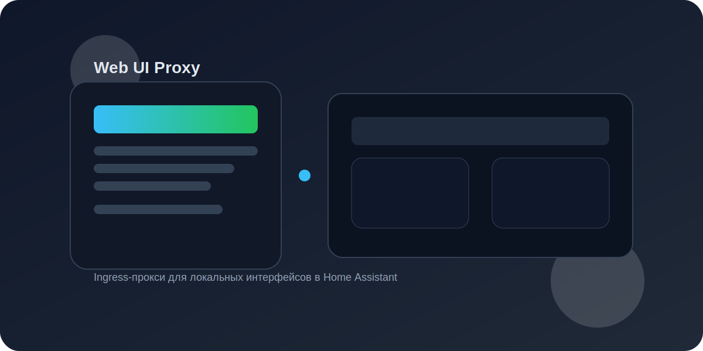

# Web UI Proxy (Home Assistant Add-on)



Проксирует локальные веб‑интерфейсы через Home Assistant Ingress, чтобы доступ к ним был доступен как из локальной сети, так и при удалённом доступе в HA.

## Возможности

- Несколько устройств в одном аддоне.
- Поддержка именованных ссылок.
- Работа через Ingress (без проброса портов наружу).
- Поддержка HTTP и HTTPS.

## Установка

1. Добавьте репозиторий аддона в Home Assistant.
2. Установите **Web UI Proxy**.
3. Заполните список устройств в конфигурации.
4. Откройте аддон через Ingress и выберите нужный интерфейс.

## Настройка

Рекомендуемый формат с именами:

```yaml
targets:
  - name: "Proxmox"
    url: "https://192.168.1.30:8006"
  - name: "MQTT Dashboard"
    url: "192.168.1.70:18083"
```

Простой формат (без имён):

```yaml
targets:
  - 192.168.1.10
  - 192.168.1.11:8080
```

## Использование

После запуска откройте аддон через Ingress. На стартовой странице будет список устройств. Нажмите нужную ссылку и получите проксированный веб‑интерфейс.

Для веб‑интерфейсов, работающих по HTTPS (например, Proxmox), указывайте URL с `https://` или используйте порт 8006 — аддон сам выберет HTTPS.

## Сохранение настроек

Аддон автоматически сохраняет список устройств в /share/webui-proxy.json. При переустановке он восстановит адреса из этого файла.

## Ограничения

- Некоторые веб‑приложения с жёстко заданными абсолютными путями `/` могут требовать подстановки префикса.
- Если интерфейс устройства не поддерживает работу за обратным прокси, поведение может быть ограниченным.

## Безопасность

Доступ к устройствам ограничен правами пользователя Home Assistant. Не публикуйте Ingress‑ссылку вне HA.
